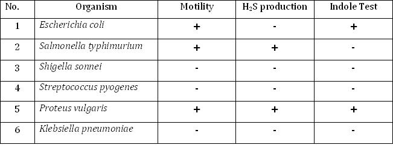

## 1. Wet Mount Slide
 
### Materials Required:
1. Microscopic slides
2. Coverslips
3. Inoculating loop
4. Micropipettes
5. Bunsen burner
6. Cultures: - Nutrient broth cultures of Micrococcus luteus and Proteus vulgaris (young cultures)
 
### Procedure:
 
#### Wet Mount Preparation
 
1. Take a clean, scratch free glass slide.
2. Label the slide with the name of the organism
3. Place 15 - 20 uL of the culture in the middle of the slide
4. Lower a clean cover slip over the drop as though it were hinged at one side avoiding bubbles
5. Examine the preparation under microscope first under 4 x followed by 40 x and 100x magnification
6. Identify the motile organisms
7. Clean up the slide with alcohol first (because it had live bacteria on it), followed by soap and water.
8. Discard the cover slip.
 
#### How to Focus:
1. First focus with the 4x objective on the edge of the coverslip. It is easier to find and focus on than the nearly transparent suspension
2. Find a bubble in the liquid suspension, and adjust the fine focus on the edge of the bubble.
3. Switch to the 10x objective, repeat the careful focusing.
4. Switch to the 40x objective, repeat the careful focusing. 
5. Apply oil and examine with the 100x oil immersion lens, again using the edge of the bubble as a focusing point.

#### Hints:
1. Unstained bacteria are very transparent and difficult to see. Therefore, while focusing, reduce the lighting sufficiently to make the organisms visible. 
2. For proof of true motility, look for directional movement that is several times the long dimension of the bacterium. The movement will also occur in different directions in the same field.
3. Ignore Brownian movement which is a vibrational movement caused by invisible molecules bombarding bacterial cells. If the only movement you see is vibrational and not directional, the organism is nonmotile.
4. If you see only a few cells exhibiting motility, consider the organism to be motile. Characteristically, only a few of the cells will be motile at a given moment.
5. Don’t confuse water current movements with true motility. Water currents are due to capillary action caused by temperature changes and drying out. All objects move in a straight line in one direction.
6. Always examine a wet mount immediately, once it has been prepared, because motility decreases with time after preparation.
 
#### Advantages:
1. Quickest means for determining motility.
2. Useful for determinating cellular shape and arrangement
 
#### Disadvantages:
1. The slide quickly dries out, rendering the organisms immotile.
2. If the organism is pathogenic, there is the possibility of danger to the person in handling viable organisms on a slide.
3. Wet mounts cannot be stored over a longer time.
 
#### Expected Results:
Motility is observed in case of Proteus vulgaris , while Micrococcus luteus is non motile

&nbsp;

## 2. Hanging Drop Slide
 
### Materials Required :
1. Clean depression slides and coverslips
2. Petroleum jelly / Vaseline
3. Inoculating loop
4. Toothpicks
5. Cultures:- 24- to 48-hour Nutrient broth cultures of Pseudomonas aeruginosa
 
### Procedure:
1. With a toothpick, spread Vaseline or Petroleum jelly on the four corner of a clean coverslip.
2. After thoroughly mixing one of the cultures, use the inoculating loop to aseptically place a small drop of the bacterial suspension in the center of a coverslip
3. Lower the depression slide, with the concavity facing down, onto the coverslip so that the drop protrudes into the center of the concavity of the slide. Press gently to form a seal.
4. Turn the hanging drop slide over and place on the stage of the microscope so that the drop is over the light hole. Examine the drop by first locating its edge under low power and focusing on the drop. Switch to the high-dry objective (40 x). To increase the contrast and to see the bacteria clearly, close the diaphragm as much as possible.
5. Distinguish between actual motility and Brownian movement
6. Discard the coverslips and any contaminated slides in a container with disinfectant solution.

#### Hints:
1. Always examine a hanging drop preparation immediately, because the organisms become less motile with time.
2. Particular care must be taken to avoid breaking the coverslip since it is more vulnerable when supported only around its edges
3. Always make sure the specimen is on the top side of the slide.
 
#### Expected Results:
Actively motile organisms (Pseudomonas aeruginosa) were observed

&nbsp;

## 3.Soft Agar Stabbing (Tube Method)
 
### Materials Required:
1. Two test tubes with SIM medium
2. Inoculating needle
3. Cultures:- Nutrient broth cultures of Klebsiella pneumoniae and Proteus vulgaris (young cultures)
 
### Procedure:
1. Label the tubes of semisolid (or SIM) media with the names of the organisms.
2. Flame and cool the inoculating needle, and insert it into the culture after flaming the neck of the tube.
3. Remove the cap from the tube of medium, flame the neck, and stab it 2⁄3 of the way down to the bottom. Flame the neck of the tube again before returning the cap to the tube.
4. Incubate the tubes at room temperature for 24 to 48 hours.
5. Examine the SIM cultures for the presence or absence of a black precipitate along the line of the stab inoculation. A black precipitate of FeS indicates the presence of H2S.
6. If desired, one can also test for indole production by adding 5 drops of Kovacs’ reagent to the SIM cultures and looking for the development of a red color at the top.

### Expected Results:
In agar stab method Proteus vulgaris showed a well dispersed growth from the line of inoculation which is evident of motility, presence of black precipitate indicates that H2S is produced and presence of red colouration in the medium after the addition of Kovac’s reagent indicates positive indole test while Klebsiella pneumoniae is non motile and negative for H2S production and indole test .

