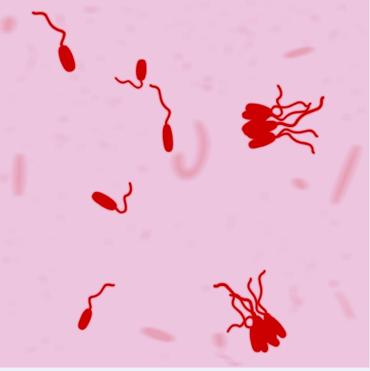
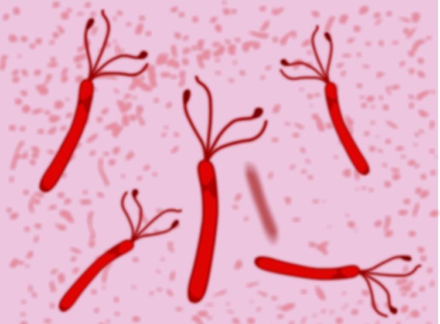

### Principle:
 
The ability of an organism to move by itself is called motility. Motility is closely linked with chemotaxis, the ability to orientate along certain chemical gradients. Eucaryotic cells can move by means of different  locomotor organelles such as cilia, flagella, or pseudopods. Procaryotes move by means of propeller-like flagella unique to bacteria or by special fibrils that produce a gliding form of motility. Almost all spiral bacteria and about half of the bacilli are motile, whereas essentially none of the cocci are motile.

 

The capacity for true motility or self-propulsion is present in a great variety of cells, but not all of them. The bacteria that show no motion are termed non-motile. However, in an aqueous environment, these same bacteria appear to be moving erratically. This erratic movement is due to Brownian movement which results from the random motion of the water molecules bombarding the bacteria and causing them to move.

 

Most  motile  bacteria  move  by  use  of  flagella, thread like  locomotor  appendages  extending  outward  from  the plasma membrane and cell wall. Motile cells may have one flagellum, but most have several. Each flagellum has a very rigid, helical structure and actual motility results from the rotation of the flagellum in a manner similar to that of a boat propeller. Motility by means of flagella is particularly important for the identification of microorganisms, for instance Bacilli are motile except for the anthrax, which is instead capsular, therefore flagella could be produced to enable the organisms to run away from danger and to move from less favorable to more favorable environment. The same is observed with  Clostridia, all are motile except Clostridium perfringens, which has a capsule. It is also been suggested that motility is an essential feature in the colonization hence pathogenicity of  Helicobacter pylori

 

The positions at which flagella are inserted into the bacterial cell are characteristic for a genus. For example, monotrichous cells have only a single flagellum and if it is located at an end, it is known to be a polar flagellum.

Fig:-Monotrichous polar flagellum seen under light microscope

&nbsp;

Amphitrichous bacterium have a single flagellum at each pole. In contrast, the genus Pseudomonas contains cells that have lophotrichous flagella, a tuft of flagella on one or both the  ends of the cell making them next to Proteus in terms of motility.

Fig:-Lophotrichous flagellum seen under light microscope

&nbsp;

Flagella are spread fairly evenly over the whole surface of peritrichous bacteria

Fig:-Peritrichous flagellum seen under light microscope

&nbsp;

When anticlockwise rotation is resumed, the cell tends to move in a new direction. This ability is important, since it allows bacteria to change direction. Bacteria can sense nutrient molecules such as sugars or amino acids and move towards them - a process is known as chemotaxis. Additionally, they can also move away from harmful substances such as waste  products and in response to temperature, light, gravity, etc.

 

Flagella are not the only means by which bacteria move about. Some bacteria exhibit a gliding motility by which they crawl over surfaces by waves of contraction produced within the cytoplasm. Gliding is defined as the movement of a non-flagellated cell in the direction of its long axis on a surface. Such organisms are extremely important in the decaying of dead organic material but are not of medical importance, because they do not cause human disease. Axial flaments, which are found only in the spirochetes, consist of protein fibrils wound spirally around the organism and attached at the two poles of the cell. They are located just beneath the membrane, where they function to impart rapid motility to the spirochete.

&nbsp;

### Motility determination:
 

Three methods are employed for motility determination depending on the pathogenic capability of the organisms. For nonpathogens, there are two slide techniques that one might use. For pathogens, tube method can be used.

1. Wet Mount slide
2. Hanging Drop slide
3. Tube Method

&nbsp;

#### Slide methods for non-pathogens include
##### 1. Wet Mount slide
##### 2. Hanging Drop slide

1. Wet Mount slide

When working with nonpathogens, the simplest way to determine motility is to place a few loopfuls of the organism on a clean slide and cover it with a cover glass. In addition to being able to determine the presence or absence of motility, this method is useful in determining cellular shape (rod, coccus, or spiral) and arrangement (irregular clusters, packets, pairs, or long chains).

2. Hanging Drop slide
 
Hanging drop slides are useful in observing the general shape of living bacteria and the arrangement of bacterial cells when they associate together. Organisms are observed in a drop that is suspended under a cover glass in a concave depression slide. The slide for a hanging drop is ground with a concave well in the center; the cover glass holds a drop of the suspension. When the cover glass is inverted over the well of the slide, the drop hangs from the glass in the hollow concavity of the slide. Since the drop lies within an enclosed glass chamber, drying out occurs very slowly. A ring of Vaseline around the edge of the cover slip keeps the slide from drying out.

&nbsp;

#### Method for pathogenic microorganisms includes
 
##### Soft Agar Stabbing (Tube Method):

It is too  dangerous to attempt to determine the motility of pathogenic microorganisms (such as the typhoid bacillus)  by slide techniques. A much safer method is to culture the organisms in a special medium that can demonstrate the presence of motility. The medium mainly used for this purpose is  SIM medium ( Sulphide Indole Motility medium) which is a combination differential medium that tests three different parameters, Sulfur Reduction, Indole Production and Motility. This media has a very soft consistency that allows motile bacteria to migrate readily through them causing cloudiness. The non-motile bacteria will only grow in the soft agar tube  and only the area where they are inoculated. But in the case of motile bacteria, they will  grow along the area of stab and will also swim out away from the stabbed area. Thus, a negative result is detected  by growth in a distinct zone directly along the stab. A positive result is indicated by diffuse or cloudy growth mostly at the top and bottom of the stab.

 

SIM agar may also be used to detect the presence of  H2S production. The SIM medium contains peptones and sodium thiosulfate  as  substrates,  and  ferrous  ammonium  sulfate, Fe(NH4)SO4,  as  the H2S  indicator. Cysteine  is  a component of the peptones used in SIM medium. Sufficient agar  is present  to make  the medium semisolid. Once H2S  is produced, it  combines with  the  ferrous ammonium sulfate, forming an insoluble, black ferrous sulfide precipitate that can be seen along the line of the stab inoculation. If the organism is also motile, the entire  tube may  turn black. This black  line or  tube  indicates a positive H2S  reaction; absence of a black precipitate indicates a negative reaction.

 

If desired, one can also test for indole production by adding 5 drops of Kovacs' reagent to the SIM cultures. Some bacteria have  the ability to produce the enzyme tryptophanase, which will hydrolyzes the tryptophan in the media.  The end products of this hydrolyzation  reaction are indole, pyruvic acid, and ammonia, by means of deamination. The Kovac's reagent that is added to the SIM medium to test for indole is a mixture of hydrochloric acid, p-dimethylaminobenzaldehyde (DMABA), and n-amyl alcohol. DMABA further reacts with indole to produce a red quinoidal compound.  If the reagent turns to  red color, the indole test is positive. The sulfur and motility test results should be determined before we perform the indole test.